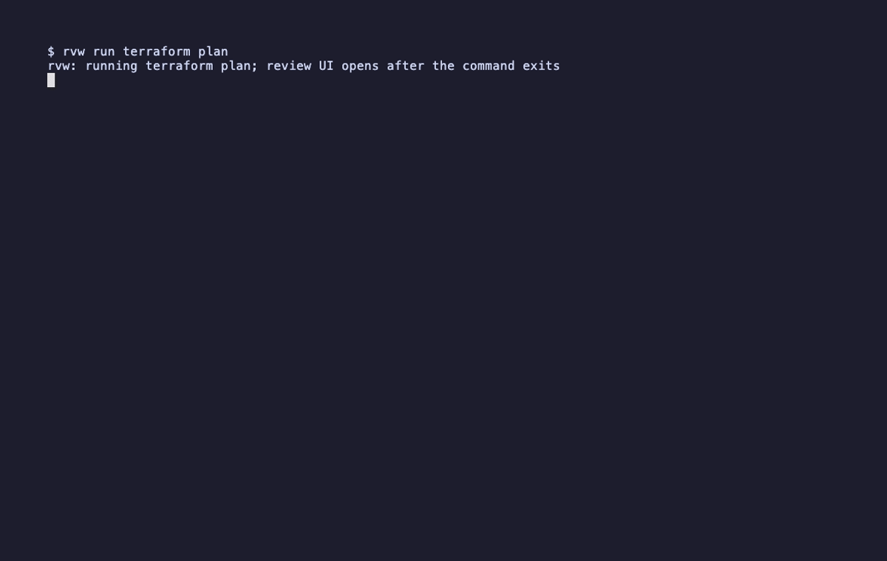

# rvw

`rvw` is a terminal review layer for command output. It runs a command, captures its output, and opens a split terminal UI where you can attach line-bound comments and copy a Markdown review report.

The MVP uses captured-output review mode. It is generic by design and is not tied to any specific command or AI tool.



## Status

`rvw` is an early MVP. It is ready to try on macOS for captured-output review workflows, but the command must finish before the TUI opens. Live streaming output, fully interactive command passthrough, persistence, and broader platform support are planned but not implemented yet.

## Install From Source

From a checked-out repository:

```sh
go install ./cmd/rvw
```

After the module is public:

```sh
go install github.com/V-Isa/rvw/cmd/rvw@latest
```

## Usage

```sh
rvw run <command> [args...]
rvw run -- <command> [args...]
rvw run --timeout=30s -- <command> [args...]
```

The command must exit before the review UI opens. For interactive tools, use their non-interactive or batch mode when available instead of launching an interactive session.

Use `--` when the reviewed command starts with flags or when you want to separate `rvw` options from command arguments:

```sh
rvw run -- go test ./...
rvw run --timeout=30s -- terraform plan
```

## Examples

Review test failures:

```sh
rvw run -- make test
rvw run -- go test ./...
```

Review recent logs:

```sh
rvw run -- tail -n 100 ./app.log
rvw run -- docker compose logs --tail=200 api
```

Review infrastructure changes:

```sh
rvw run -- terraform plan
```

If the reviewed command exits with a non-zero status, `rvw` still opens the review UI and shows the child exit code. `rvw` exits based on whether the review session completed successfully, not based on the reviewed command's exit code.

Command output is captured in memory with a default 25 MiB cap. If output exceeds the cap, `rvw` appends a truncation marker to the transcript.

Command arguments are shown in the TUI and Markdown report. Avoid putting secrets directly in command arguments when you plan to share exported reviews.

## Privacy And Security

- `rvw` runs locally and does not make external API calls.
- `rvw` does not collect telemetry.
- Reviewed command output, command arguments, and comments stay in memory unless you copy the Markdown report to the clipboard.
- Exported Markdown may contain sensitive command output, command arguments, or review comments. Review it before sharing.
- `rvw` executes the command you provide with `exec.CommandContext`; it does not invoke a shell unless you explicitly run one, such as `rvw run -- sh -c '...'`.

## Markdown Export

Press `e` or `y` to copy a Markdown report:

```markdown
# rvw review

Command:
`go test ./...`

Exit code: `1`

## Comments

### L42
Selected line:
> --- FAIL: TestExample

Comment:
Check whether the fixture setup changed.
```

## Shortcuts

- `j` / `k` or `up` / `down`: move through output lines
- `c`: add, edit, or clear a comment for the current line
- `enter`: save comment while editing
- `esc`: cancel comment editing
- `e` or `y`: copy Markdown review to clipboard
- `q`: quit

## Current Limitations

- Captures output first, then opens the review UI.
- Interactive commands that do not exit are not supported yet.
- Comments are in memory only.
- One comment per output line.
- Clipboard support is macOS-first through `pbcopy`.
- No mouse support, inline output comments, daemon, telemetry, external API calls, or AI-tool-specific plugin.

## Platform Support

| Platform | Status       | Notes                              |
| -------- | ------------ | ---------------------------------- |
| macOS    | Supported    | Uses `pbcopy` for clipboard export |
| Linux    | Experimental | Clipboard support planned          |
| Windows  | Planned      | PTY and clipboard support pending  |

## Development

```sh
GOCACHE=$PWD/.cache/go-build go test ./...
GOCACHE=$PWD/.cache/go-build go vet ./...
GOCACHE=$PWD/.cache/go-build go build ./...
GOCACHE=$PWD/.cache/go-build GOLANGCI_LINT_CACHE=$PWD/.cache/golangci-lint golangci-lint run ./...
GOCACHE=$PWD/.cache/go-build $(go env GOPATH)/bin/govulncheck ./...
```

## Roadmap

See [ROADMAP.md](ROADMAP.md) for planned MVP refinements, portability work, and future product expansion.

## License

MIT © 2026 Vadim Isaenko
